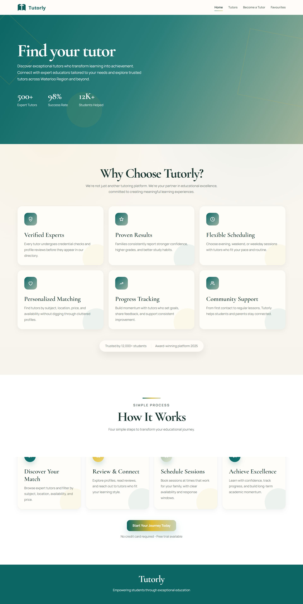
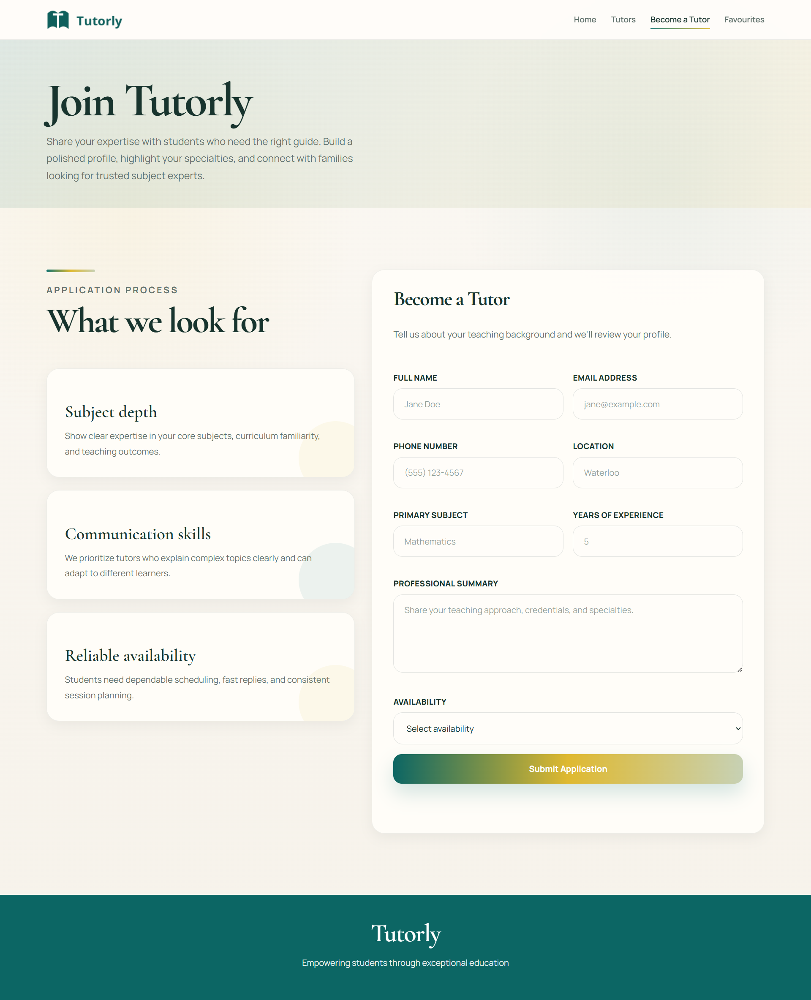
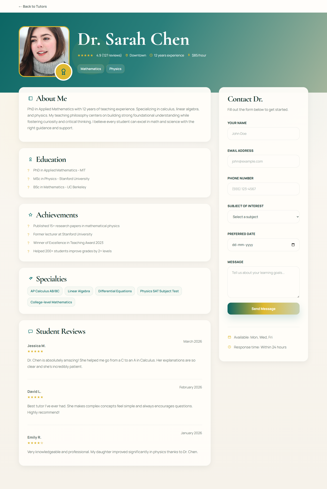
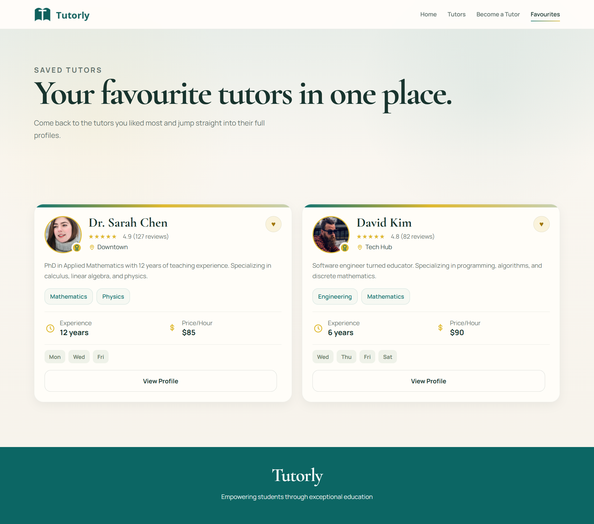

# 🎓 Tutorly

## 📌 Project Overview

**Tutorly** is a modern tutor discovery web application that helps students and parents find, filter, and connect with tutors based on subject, location, and availability.

The platform combines **dynamic data rendering**, **interactive maps**, and **real-time filtering** to deliver a seamless and intuitive user experience.

---

## 🧠 Project Pitch

Finding the right tutor can be time-consuming and inefficient. Tutorly simplifies this process by providing a centralized platform where users can easily discover tutors, view profiles, and make informed decisions.

---

## 👤 User Persona

* Students looking for subject-specific help
* Parents searching for reliable tutors
* Users who prefer location-based tutor discovery

---

## ❗ Problem

Users often struggle to:

* Find verified tutors quickly
* Compare tutors efficiently
* Locate nearby tutors easily

---

## 💡 Solution

Tutorly solves this by offering:

* Advanced filtering system
* Interactive map with tutor locations
* Clean and accessible UI
* Favorites system for quick access

---

## Low-Fidelity Wireframe

* Desktop View : https://www.figma.com/proto/gKT7BETpbj8ruwviSV6gIE/Tutorly-Design-System?node-id=1-7&t=1o2ZIOWDh0PNBIwr-1
* Mobile View : https://www.figma.com/proto/gKT7BETpbj8ruwviSV6gIE/Tutorly-Design-System?node-id=1-82&t=1o2ZIOWDh0PNBIwr-1

---

## ✨ Features

* 🔍 **Real-time Search & Filtering**
* 📍 **Interactive Map with Tutor Pins (Leaflet.js)**
* ❤️ **Favorites System (LocalStorage)**
* 📄 **Tutor Detail Pages**
* 📱 **Fully Responsive Design**
* ♿ **Accessibility Support (ARIA, semantic HTML)**
* 🎨 **Custom SVG Icons & Branding**
* ⚡ **Smooth Animations & Transitions**

---
## 🖼️ Screenshots

### 🏠 Homepage



### 🔎 Tutor Listing


### 📍 Become A Tutor



### 📄 Tutor Details



### 📄 Favourites



---

## 🧩 Tech Stack

* **HTML5** – Semantic structure
* **CSS3** – Responsive layout & design system
* **JavaScript (Vanilla)** – Logic & interactivity
* **Leaflet.js** – Interactive maps
* **LocalStorage** – Favorites persistence

---

## 🏗️ Project Structure

```
tutorly/
│
├── index.html
├── tutors.html
├── tutor-details.html
├── favourites.html
├── become-tutor.html
│
├── css/
│   └── style.css
│   └── responsive.css
│
├── js/
│   ├── main.js
│
├── data/
│   └── tutors.json
│
├── assets/
│   └── images & screenshot
│
└── README.md
```

---


## 🎯 Key Learnings

* DOM manipulation and event handling
* Geolocation and distance calculations
* Interactive UI with map integration
* Building scalable multi-page applications

---

## 📐 Design System

### 🎨 Colors

* Primary: #0c6664
* Secondary: #dfb930
* Text: #29463f
* Heading: #18342e

### 🔤 Typography

* Headings: Cormorant Garamond
* Body: Manrope

---

## 🔮 Future Improvements

* User authentication
* Booking system backend
* Tutor reviews & ratings
* Chat functionality
* Dark mode

---

## 🙌 Acknowledgements

* Leaflet.js for maps
* Open-source community

---

## 💼 Author

**Dhruti Bhatt**
Frontend Developer

---

## ⭐ If you like this project

Give it a ⭐ on GitHub!
